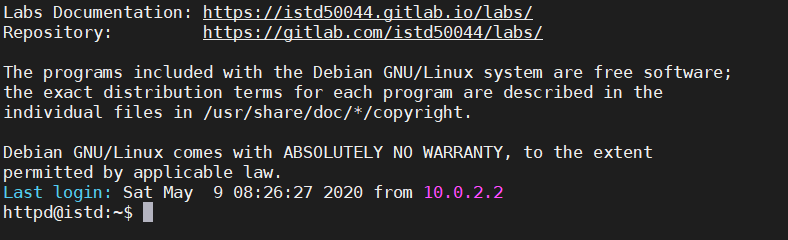

# 50.044 Systems Security

###### A practical introduction to systems security

Check the course labs online documentation on https://istd50044.gitlab.io/labs/ to get started.

The documentation is generated by [Vuepress](https://vuepress.vuejs.org/) which translates Markdown files (.md) to a single page html website. You can alternatively build your own offline documentation of the labs by following the instructions on [documentation/README.md](documentation). 
